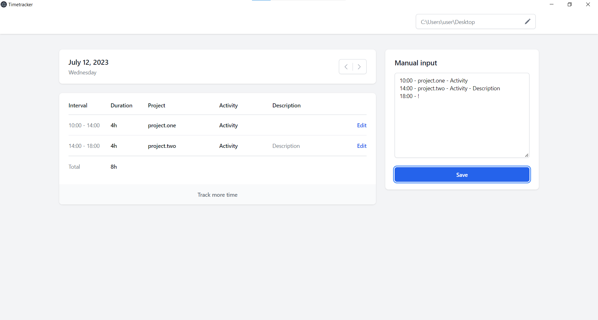

<a name="readme-top"></a>


<!-- PROJECT SHIELDS -->
[![Contributors][contributors-shield]][contributors-url]
[![Forks][forks-shield]][forks-url]
[![Stargazers][stars-shield]][stars-url]
[![Issues][issues-shield]][issues-url]
[![MIT License][license-shield]][license-url]
[![LinkedIn][linkedin-shield]][linkedin-url]


<!-- PROJECT LOGO -->
<br />
<div align="center">
  <a href="https://github.com/mmmykhailo/timetracker">
    
  </a>

  <h3 align="center">Timetracker</h3>

  <p align="center">
    Application for easy creation of time reports.
  </p>
</div>


<!-- TABLE OF CONTENTS -->
<details>
  <summary>Table of Contents</summary>
  <ol>
    <li>
      <a href="#about-the-project">About The Project</a>
      <ul>
        <li><a href="#built-with">Built With</a></li>
      </ul>
    </li>
    <li>
      <a href="#getting-started">Getting Started</a>
      <ul>
        <li><a href="#installation">Installation</a></li>
      </ul>
    </li>
    <li><a href="#usage">Usage</a></li>
    <li><a href="#contact">Contact</a></li>
  </ol>
</details>


<!-- ABOUT THE PROJECT -->
## About The Project



The application is designed to quickly and easily create time reports.

<p align="right">(<a href="#readme-top">back to top</a>)</p>


### Built With

* [![Next][Next.js]][Next-url]
* [![Electron][Electron.js]][Electron-url]
* [![Typescript][Typescript]][Typescript-url]
* [![Tailwind][Tailwind.com]][Tailwind-url]

<p align="right">(<a href="#readme-top">back to top</a>)</p>


<!-- GETTING STARTED -->
## Getting Started

This is an example of how you may give instructions on setting up your project locally.
To get a local copy up and running follow these simple example steps.

### Installation

1. Clone the repo
   ```sh
   git clone https://github.com/mmmykhailo/timetracker.git
   ```
2. Install packages
   
   Using yarn or npm
   ```sh
   yarn (or `npm install`)
   ```
    Using pnpm
   ```sh
   pnpm install --shamefully-hoist
   ```


<p align="right">(<a href="#readme-top">back to top</a>)</p>

## Usage

Development mode
```sh
yarn dev (or `npm run dev` or `pnpm run dev`)
```
Production build
```sh
yarn build (or `npm run build` or `pnpm run build`)
```
<p align="right">(<a href="#readme-top">back to top</a>)</p>

## Contact

Project Link: [https://github.com/mmmykhailo/timetracker](https://github.com/mmmykhailo/timetracker)

<p align="right">(<a href="#readme-top">back to top</a>)</p>


<!-- MARKDOWN LINKS & IMAGES -->
<!-- https://www.markdownguide.org/basic-syntax/#reference-style-links -->
[contributors-shield]: https://img.shields.io/github/contributors/mmmykhailo/timetracker.svg?style=for-the-badge
[contributors-url]: https://github.com/mmmykhailo/timetracker/graphs/contributors
[forks-shield]: https://img.shields.io/github/forks/mmmykhailo/timetracker.svg?style=for-the-badge
[forks-url]: https://github.com/mmmykhailo/timetracker/network/members
[stars-shield]: https://img.shields.io/github/stars/mmmykhailo/timetracker.svg?style=for-the-badge
[stars-url]: https://github.com/mmmykhailo/timetracker/stargazers
[issues-shield]: https://img.shields.io/github/issues/mmmykhailo/timetracker.svg?style=for-the-badge
[issues-url]: https://github.com/mmmykhailo/timetracker/issues
[license-shield]: https://img.shields.io/github/license/mmmykhailo/timetracker.svg?style=for-the-badge
[license-url]: https://github.com/mmmykhailo/timetracker/blob/master/LICENSE.txt
[linkedin-shield]: https://img.shields.io/badge/-LinkedIn-black.svg?style=for-the-badge&logo=linkedin&colorB=555
[linkedin-url]: https://linkedin.com/in/mmmykhailo
[product-screenshot]: images/screenshot.png
[Next.js]: https://img.shields.io/badge/next.js-000000?style=for-the-badge&logo=nextdotjs&logoColor=white
[Next-url]: https://nextjs.org/
[Electron.js]: https://img.shields.io/badge/Electron-14354C?style=for-the-badge&logo=electron&logoColor=3498DB
[Electron-url]: https://www.electronjs.org/
[Typescript]: https://img.shields.io/badge/TypeScript-007ACC?style=for-the-badge&logo=typescript&logoColor=white
[Typescript-url]: [https://reactjs.org/](https://www.typescriptlang.org/)
[Tailwind.com]: https://img.shields.io/badge/Tailwind_CSS-38B2AC?style=for-the-badge&logo=tailwind-css&logoColor=white
[Tailwind-url]: https://tailwind.com 
